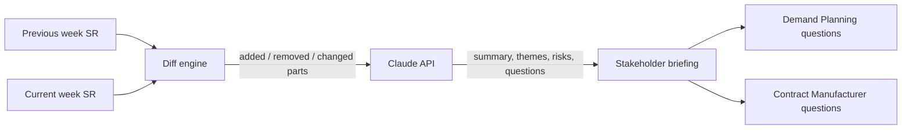

# SCAI · Reconciliation Agent
### Module 01 of Supply Chain Agentic Intelligence (SCAI)

**Supply Chain Agentic Intelligence (SCAI)** is an ongoing personal initiative exploring how agentic AI can support the parts of supply chain and demand planning work that are recurring, high-volume, and judgment-heavy — the kind of work that currently gets done by hand every week. This repository is the first working module: an agent that automates weekly Schedule Receipt reconciliation across Contract Manufacturers and demand planning teams.

## About SCAI

Supply chain and demand planning roles share a recurring pattern: structured data has to be compared against a prior version (schedules, supplier scorecards, BOM/component mappings, freight invoices), and then someone has to apply judgment about what changed, why it matters, and who to ask. SCAI is built on a simple design principle applied across every module: **deterministic code does the comparison, the model does the reasoning.** Code never hallucinates a changed quantity; the model is reserved for the part that actually benefits from judgment — interpreting what a change means and what to ask about it.

| Module | Status | What it does |
|---|---|---|
| **01 — Reconciliation Agent** | ✅ Built (this repo) | Diffs weekly Schedule Receipts and generates stakeholder-ready questions for Contract Manufacturers and demand planning |
| 02 — Supplier Scorecard Agent | 🧭 Planned | Tracks fulfillment accuracy and lead-time adherence, flags suppliers trending out of tolerance |
| 03 — BOM Standardization Agent | 🧭 Planned | Detects component/BOM mapping inconsistencies across multi-SKU workflows |
| 04 — Freight & Landed Cost Auditor | 🧭 Planned | Reconciles freight invoices against expected landed cost, flags overcharges |

---

## Module 01: Reconciliation Agent

An agentic AI workflow that automates weekly Schedule Receipt (SR) reconciliation across Contract Manufacturers and demand planning teams, detecting part-level demand signal changes and generating targeted stakeholder questions.

## Context

Hardware supply chains that rely on external Contract Manufacturers face a structurally similar reconciliation challenge regardless of company: every week, the latest Schedule Receipt has to be checked against the prior week's to catch part-level changes before they affect downstream planning. This project is a personal exploration of that general problem space, built around generic, industry-standard supply chain concepts (forecast vs. commit, CM-based contract manufacturing, part-level schedule receipts).

All data structures and sample records in this repository are synthetic and self-constructed. No proprietary, confidential, or internal data, systems, or documentation from any employer — current, former, or otherwise — were used in building this project.

## The problem

Large-scale hardware supply chains that rely on external Contract Manufacturers face a recurring planning challenge: every week, the latest Schedule Receipt has to be manually cross-checked line by line against the prior week's version to spot what changed across part numbers, CM locations, commit types, quantities, and dates. Once a change is found, someone still has to figure out who to ask and what to ask them. This is slow, error-prone, and does not scale across hundreds of SKUs and multiple Contract Manufacturers.

## The solution

This agent removes the manual diffing step and the blank-page problem of "what do I even ask." It:

1. Parses two SR snapshots (previous week vs. current week)
2. Programmatically detects every part that was added, removed, or changed (quantity, type, date, CM location, platform)
3. Sends the structured diff to Claude, which reasons about the business implications
4. Returns a decision-ready briefing: an executive summary, key themes, risk flags, and two separate sets of pointed questions — one for the internal demand planning team, one for external Contract Manufacturers

The deterministic diffing (step 2) is done in code, not by the model, so the comparison itself is exact and auditable. The model is only used for the part that actually requires judgment: interpreting what the changes mean and what to ask about them.

## How it works



1. **Input** – SR data is pasted in (tab-separated or CSV, copy-pasted directly from Excel)
2. **Parse** – rows are normalized into structured records keyed by part number
3. **Diff** – a deterministic comparison flags additions, removals, and field-level changes
4. **Reason** – the diff is passed to Claude with a system prompt scoped to supply chain reconciliation, returning structured JSON
5. **Present** – results render as a change log, risk flags, and two stakeholder-specific question sets

## Features

- Deterministic part-level diffing (added / removed / changed) across all SR fields
- AI-generated executive summary and key themes for each week's changes
- Risk flagging for changes likely to need escalation
- Separate, targeted question sets for demand planning vs. Contract Manufacturers
- Works directly from Excel copy-paste — no file format conversion needed
- No raw SR data sent to the model — only the computed diff and row counts are sent, minimizing exposure of unrelated fields

## Tech stack

- **Frontend:** React (functional components, hooks)
- **Reasoning:** Claude API (`claude-sonnet-4` family), structured JSON output
- **Diff logic:** plain JavaScript, no external dependencies

## Project structure

```
scai-reconciliation-agent/
├── src/
│   └── SRAgent.jsx        # Main component: parsing, diffing, API call, UI
├── docs/
│   └── ARCHITECTURE.md    # Design notes and data flow detail
├── package.json
├── LICENSE
└── README.md
```

## Getting started

```bash
git clone https://github.com/<your-username>/scai-reconciliation-agent.git
cd scai-reconciliation-agent
npm install
npm run dev
```

### API key

This project calls the Anthropic Messages API. For local development:

1. Get an API key from the [Anthropic Console](https://console.anthropic.com/)
2. Route requests through a small backend or serverless function that injects the key server-side

**Do not call the Anthropic API directly from client-side code with an exposed key.** The original prototype of this project ran inside Claude.ai's Artifacts environment, where API calls are proxied and authenticated automatically. A standalone deployment needs an equivalent backend proxy — see `docs/ARCHITECTURE.md` for a minimal example.

## Usage

1. Paste last week's SR into the left field, this week's into the right field (or load the sample data to try it immediately)
2. Click **Run analysis**
3. Review the change log, risk flags, and the two stakeholder question lists
4. Use **New analysis** to reset and run the next week's comparison

## Sample input format

| part_number | cm_location   | type     | date       | qty | product_code | platform |
|--------------|---------------|----------|------------|-----|---------------|----------|
| 1234567      | Taiwan        | commit   | 04/07/2026 | 13  | AB            | ABC200   |
| 1245678      | Mumbai, India | forecast | 04/07/2026 | 18  | XY            | MCD530   |

Header row is optional — the parser detects it automatically.

## Future enhancements

- Direct ingestion from Google Drive / SharePoint instead of manual paste
- Cross-check against System E and System K for an additional source-of-truth reconciliation layer
- Persist historical diffs to track recurring discrepancy patterns by CM or part family
- Export the briefing directly to email or a Word document for distribution
- Slack/Teams notification on high-risk flags

## License

MIT — see [LICENSE](LICENSE)
